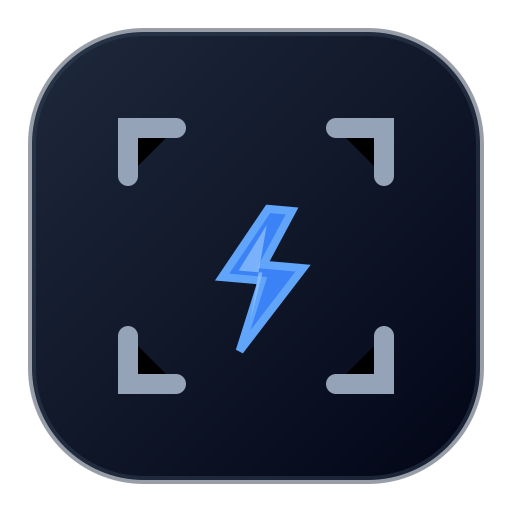

  
# ZapRec
  
**Lightning-fast screen & PIP recording.**
屏幕与镜头，极速同框。

---

## 💡 设计哲学 (Philosophy)

**“如闪电般敏捷，如空气般无感。”**

ZapRec 诞生于对现有录屏软件臃肿体验的反思。我们认为，一款极致的效率工具不应该抢夺用户的注意力。
因此，ZapRec 确立了 **“录制前自由搭建，录制中绝对锁定”** 的极简设计哲学。摒弃一切干扰创作的弹窗、复杂的悬浮球与录制中途的繁琐设置，将 100% 的屏幕空间与系统性能还给你的核心内容。

## ✨ 核心体验 (Key Features)

### ⚡️ 瞬息捕获 (Instant Capture)
* **全景与聚焦**：支持全屏、指定应用窗口以及自由区域的极速录制。
* **像素级选区**：独创的丝滑框选交互，指哪打哪，所见即所得。

### 👁️‍🗨️ 沉浸式画中画 (Immersive PIP)
* **纯净视界**：提供完美的圆形与矩形人像小窗，彻底消灭“幽灵边框”与视觉残影，犹如悬浮在屏幕上的纯净水滴。
* **直觉缩放**：对标顶级设计软件的缩放手感。矩形 8 点全视角控制，圆形 4 点强制等比缩放，告别人脸畸变与拉伸。
* **鼠标穿透**：透明区域绝不阻挡桌面操作，让画中画与底层应用完美融合。

### 🎯 零干扰录制 (Distraction-Free)
* **状态锁定**：按下录制键的瞬间，工具条与画中画即刻进入“防误触锁定状态”。悬停不再闪烁，画面不再乱跑，给你最安心的“取景器”体验。
* **极低占用**：纯粹的物理捕获架构，告别卡顿与掉帧，让你的演示、游戏或代码编写始终保持 60fps 的流畅度。

## 🎯 适用场景 (Use Cases)

ZapRec 是以下场景的完美搭档：
* **异步沟通**：快速录制带有你人像和声音的产品演示，替代冗长乏味的文字会议。
* **教学与培训**：清晰展示屏幕操作步骤，配合画中画增强讲师的临场感与亲和力。
* **Bug 报告**：秒开秒录，精准框选报错区域，让沟通成本降至最低。
* **灵感记录**：捕捉转瞬即逝的屏幕画面与语音解说，不错过任何一个好点子。

## 🚀 快速体验 (Getting Started)

### 下载安装
前往 Releases 页面下载适用于 macOS 或 Windows 的最新安装包。

### 开发者本地运行
如果你希望在本地编译或参与贡献：

    # 克隆仓库
    git clone [https://github.com/your-org/zaprec.git](https://github.com/your-org/zaprec.git)

    # 安装依赖
    npm install

    # 启动应用
    npm run dev

## 🤝 参与构建 (Contributing)

ZapRec 致力于打造桌面端最纯粹的录屏体验。如果你认同我们的极简设计理念，欢迎提交 Issue 反馈建议，或通过 Pull Request 参与代码贡献。

## 📄 许可协议 (License)

[MIT License](LICENSE) © ZapRec Team
